# 双枪舵轮步兵

#### 说明

* 此代码为RM2021赛季深圳大学RobotPilots战队的舵轮步兵代码
* 代码中包含了两种陀螺仪（BMI270和MPU6050）的驱动
* 代码只包含一台舵轮步兵的控制参数和逻辑，不需要通过system.h中的Infantry宏定义控制步兵ID
* 舵轮步兵包含云台、底盘、超电控制主控共计3主控，通过system.h中的Master宏定义控制主控ID（不包括超电控制主控代码）
* **步兵操作思维导图、舵轮控制原理** 放在doc文件夹中

**云台代码功能：**

接收遥控器控制命令，作为主机定义整车系统状态，监测整车信息标志位等等，控制云台Yaw、Pitch双轴运动，与视觉通信，控制打弹及热量限制，下发控制命令。

**底盘代码功能：**

接收云台主控的系统状态信息，与裁判系统通信、负责UI绘制并上传裁判系统数据，并与超电控制主控通信、负责底盘功率限制和控制底盘4个驱动电机、负责控制舵电机朝向控制等任务。

# A

### 开发依赖工具：Keil

### 开发系统环境：windows10

### 开发硬件环境：STM32F407

# B

### 编译方式：C/C++编译

### 代码烧录：Jlink烧录

# C

### **文件目录结构、代码内容等说明：**

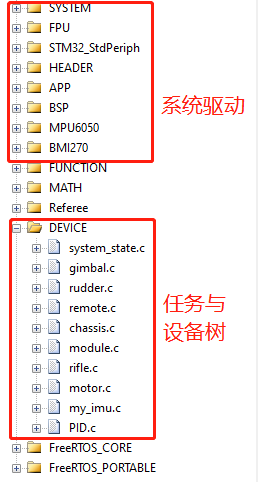

* **rudder.c文件为舵轮控制代码**

* 系统驱动部分的代码主要为基础外设驱动、stm32底层驱动程序以及外设参数初始化程序

* FUNCTION文件夹为视觉功能（自瞄、打符）的控制代码

* 设备树DEVICE文件夹中的所有代码.c文件第一个函数均为任务执行函数，motor文件中为整车电机管理程序，my_imu文件中存放对于陀螺仪数据的处理程序

* 任务调度表位于APP文件夹中的FreeRTOS_Init.c文件中

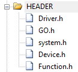

* 在“系统驱动”部分的代码中有包含了部分中间层软件库

  Driver.h中包含了简单的电机数据收发统一管理库和PID基本算法、模式辨别类

  GO.h中包含了RP机器人队伍统一的模式和整车逻辑管理类

# D

### 程序架构

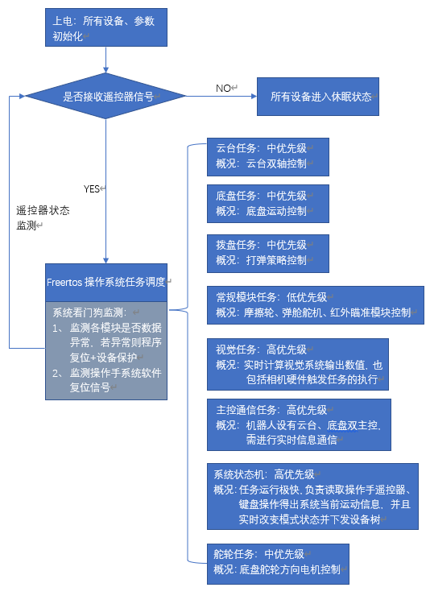

### 通信数据流线路框图

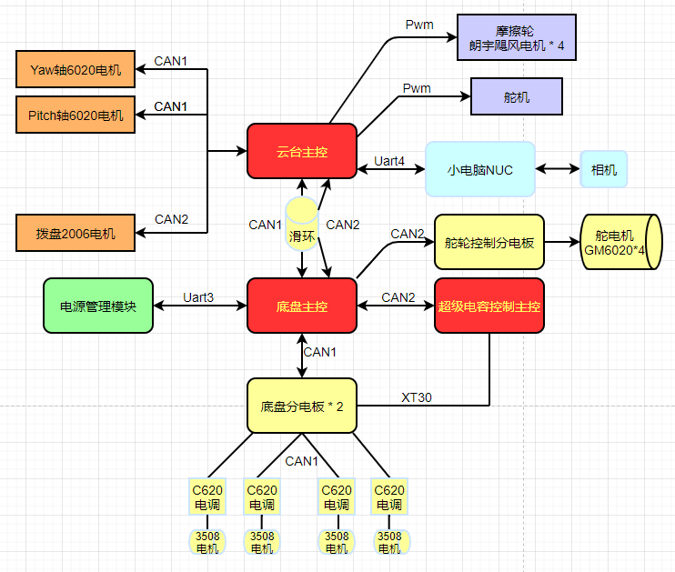

### 供电线路框图和裁判系统连接图

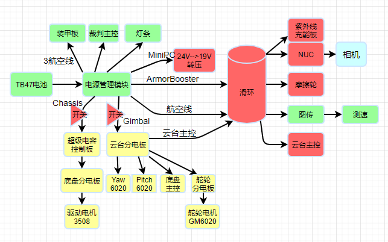

# E 重要代码原理介绍与理论支持分析

### 1、舵轮控制原理

> ## <u>***具体详细的解算控制分析都在doc文件夹的文档中***</u>

### 								

以左前轮的速度合成解算为示例，说明文档中有具体分析

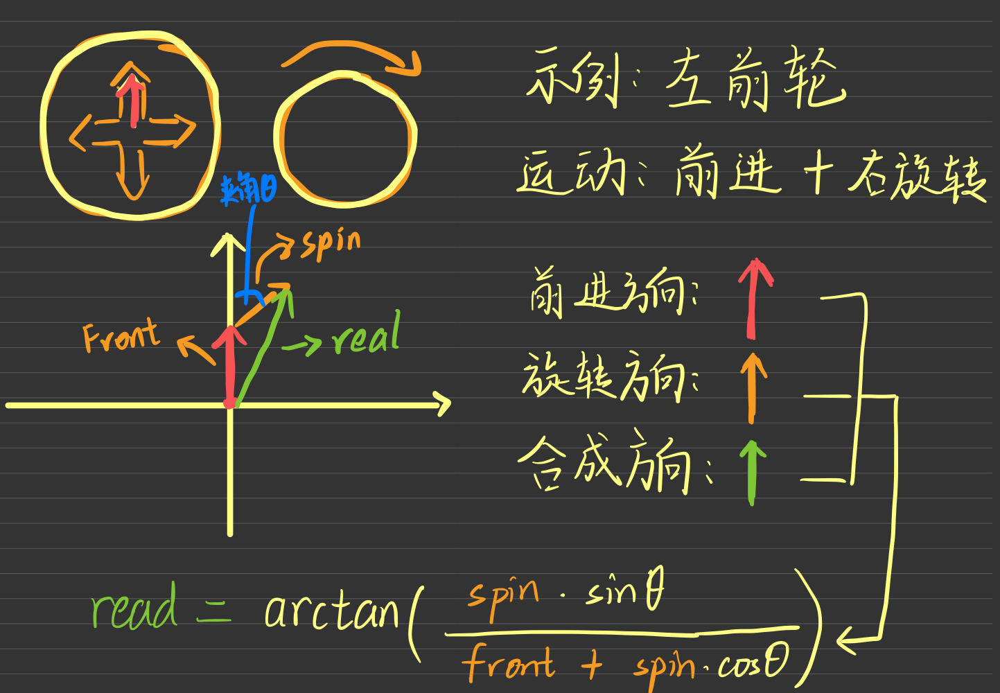

核心算法如图：

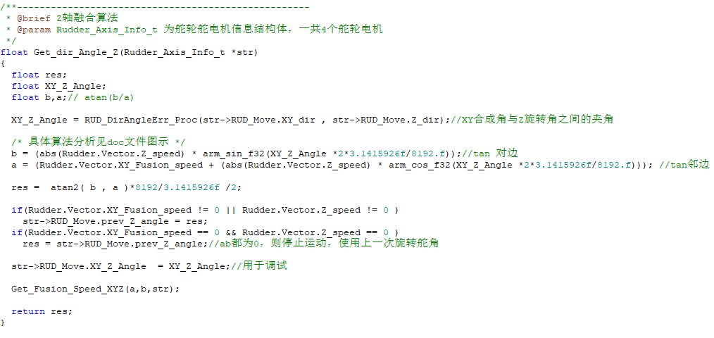

### 2、双枪控制与枪管切换 

​		发射机构为单拨盘双枪管垂直摩擦轮电机结构，在切换枪管的控制上，在学校调试时卡弹的情况难以避免，故卡弹处理对于枪管的切换有很大帮助，**具体代码位于Rifle.c文件中**，包含拨盘卡弹处理以及双枪切换条件的设置，控制上设置了手动切换枪管和自动切换枪管，不可同时打弹。

### 3、系统控制命令捕捉

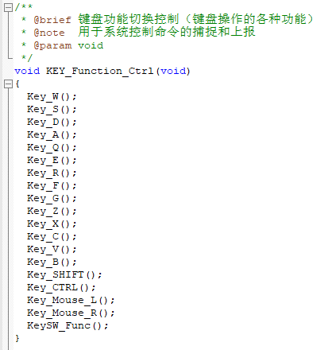

​		每个函数当中不存在轮询，执行速度较快，可以实时、同时（执行速度在1ms内）捕捉各个按键的反应值，系统采用状态检测后上报系统，再下发各个设备树任务响应状态的写法，在每个按键函数中能够清楚反映操作意图，以Z按键为例：

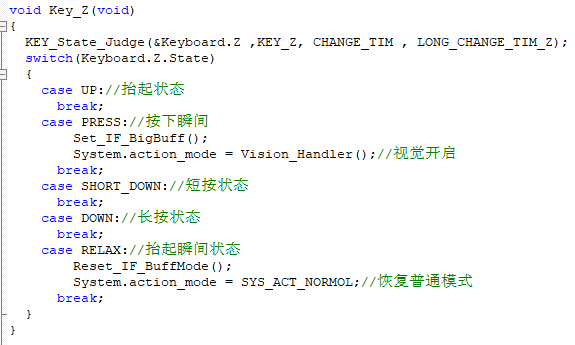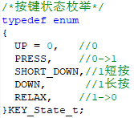

​		每个按键的5个状态在不同功能操作上发挥不同的作用，这使得后期采纳操作手反馈、商讨做出修改更加快捷、可观、有规划，并且能够保证代码整洁性和稳定性。

​		同样，对于遥控器的控制也有类似的操作，**具体程序均位于Remote.c中**。

# F 程序层级

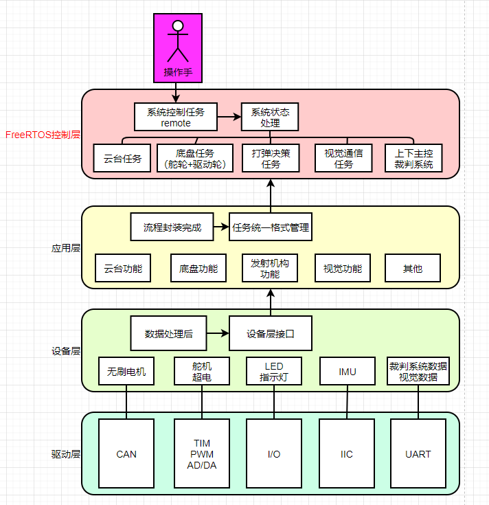

# G 未来优化方向

1、舵轮底盘的加减速目前是一个变斜率的斜坡函数，目前能缓解一定程度的加减速带来的车身平衡影响和倾覆，但响应不能太快，加减速有一定延迟，需要采用更优的策略，由于紧迫的时间关系，比赛前没来得及调试。

2、CAN1作为上下主控的通信线路负担可能较大，但目前能够维持整车正常运行，是由于一开始规划不当所导致。CAN1和CAN2的任务分配上可进行优化。

3、双枪云台的4个摩擦轮电机本身存在弊端，Pwm电机在堵转时会出现重启重校准导致尿弹，未来摩擦轮电机选型会优化。

小小鸣谢

在此特别感谢深圳大学RobotPilots战队给予我这么一个共同努力热情满满的大家庭，不论是哪一个组别的伙伴们一年来都辛苦了，尤其是步兵组的全体成员！同时也感谢全国所有学校共同呈现如此精彩的技术交流，祝愿所有为了梦想而努力的机甲大师们未来一帆风顺，成为自己人生中的机甲大师！

